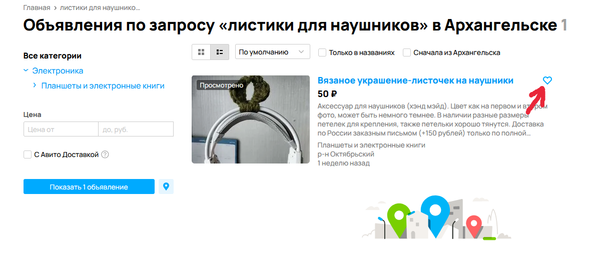
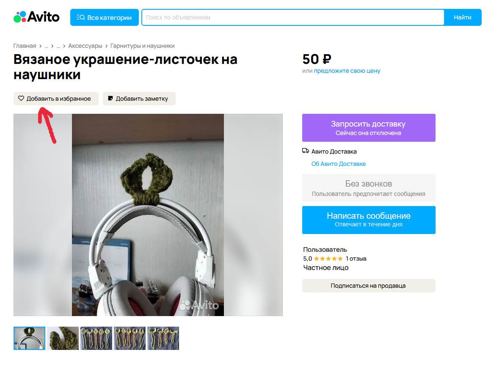

# Функционал добавления в "Избранное"
Тэги: _Регрессионое, функциональное, автоматизированное, "Избранное"_
### Цели тестирования
* Объявление можно добавить в избранное
* Объявление появляется в списке "Избранное"
### Сценарии добавления объявления в избранное
* Со страницы поиска

* Со страницы объявления

### Кейсы для автоматизации:
* Со страницы поиска
* Со страницы объявления
### Входные данные для каждого теста
* Id объявления
* Проверка для неавторизованного пользователя
* Desktop-версия последней стабильной версии Chrome-браузера
### Критерии прохождения теста
1. Объявление найдено
2. Кнопка "Добавить в избранное" работает
3. В списке ["Избранное/Объявления"](https://www.avito.ru/favorites) присутствует добавленное объявление
### Составление списка тестовых объявлений
* Из разных городов и регионов
* Из разных категорий и подкатегорий
* С разным временем выкладывания